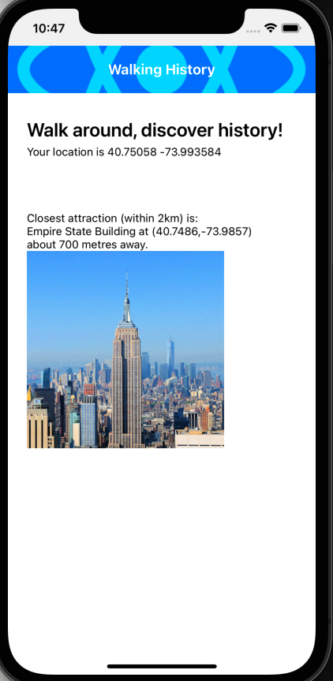

The Walking History sample application uses the Parse database and GeoPoints APIs. It is a React Native application that allows you to walk around New York City (or simulate that in a device emulator) and it tells you about the closest attraction or point of interest.  

# Getting Started

This assumes a pre-existing stack of [Parse Server](https://parseplatform.org) and [Oracle Free 23ai](https://www.oracle.com/database/free/)

[Configuring Mobile Application Development Stack](https://github.com/oracle-samples/oracleadapter-parse) - learn how to configure local full stack development environment


## Step 1: Download Dependencies

After cloning the repo into walkinghistory directory

Run the following commands to download the dependencies of the  Walking History project:

```bash
npm install

# if developing on MacOS
npx pod install
```

## Step 2: Load Place of Interest Data

Update create-poi-data.sh with the local stack values

```bash
    Parse.initialize("APPLICATION_ID");
    Parse.serverURL = 'http://localhost:1338/parse';
```
and run the script

```bash
./create-poi-data.sh 
```

This will populate the database with New York City places of interest

## Step 3: Modifying your App

Update useEffect method in Location.tsx to point at the local stack

```bash
        Parse.initialize('APPLICATION_ID');
        Parse.serverURL = 'http://localhost:1338/parse';
```
Fix an issue in react-native ParseLiveQuery.js

```bash
vi ./node_modules/parse/lib/react-native/ParseLiveQuery.js
# and comment out the following line
var LiveQuery = function () {
  function LiveQuery() {
    (0, _classCallCheck2.default)(this, LiveQuery);
    var EventEmitter = _CoreManager.default.getEventEmitter();
    this.emitter = new EventEmitter();
    this.on = this.emitter.on;
    this.emit = this.emitter.emit;
//    this.on('error', function () {});
```
## Step 4: Run the App

Set the IPhone Simulator location to Penn Station New York City

Simulator->Features->Location->Custom Location

```bash
Latitude:  40.75058
Longitude: -73.993584
```

and start the application

```bash
npx react-native run-ios
```




You've successfully run your React Native Walking History App. :partying_face:


